# TicSys-microservice (Ongoing)
> A microservice-based system for the TicSys - an event ticketing platform.

[](https://www.java.com/)
[](https://spring.io/projects/spring-boot)
[](https://www.docker.com/)
[](https://www.postgresql.org/)

## 🚀 Overview
This project is a microservice-based system for the TicSys, an event ticketing platform. It is designed to handle various aspects of ticket sales, user management, and event organization.

**🔗 Frontend Repository:** [ticsys-client](https://github.com/pqkkkkk/ticsys-client)

## 🛠️ Technologies
- **Java**: The primary programming language used for backend development.
- **Spring**: Use Spring ecosystem for building the microservices.
- **Docker**: Containerization of the application for easy deployment and scalability.
- **PostgreSQL**: Relational database management system for data storage.
- **gRPC**: For service communication.
- **OpenAPI**: For API documentation and client generation.

## 🏗️ System Architecture
### Architecture Diagram

```mermaid
graph TD
    FE[Client App]
    AG[API Gateway]

    FE --> AG

    subgraph Services
        Identity[Identity Service 🛡️]
        Event[Event Service 🎫]
        Promotion[Promotion Service 🎁]
        Order[Order Service 🛒]
        Payment[Payment Service 💳]
        Query[Query Service 🔍]
        Notification[Notification Service 🔔]
    end

    AG --> Identity
    AG --> Order
    AG --> Payment
    AG --> Event
    AG --> Promotion

    subgraph Databases
        DB1[(User DB)]
        DB2[(Order DB)]
        DB3[(Payment DB)]
        DB4[(Event DB)]
        DB5[(Promotion DB)]
        DB6[(Query DB)]
    end

    Identity --> DB1
    Order --> DB2
    Payment --> DB3
    Event --> DB4
    Promotion --> DB5
    Query --> DB6

    subgraph Discovery
        Eureka[Service Discovery]
    end

    Services --> Eureka
    AG --> Eureka
```


### Detail Explanation
- **Client App**: The frontend application that interacts with the API Gateway.
- **API Gateway**: As a single entry point for all client requests, routing them to the appropriate services. API Gateway handles load balancing and circuit breaking using Spring Cloud. It is also a first filter for security, authentication requests before forwarding them to the services.
- **Services**: Each microservice handles a specific domain, each services register itself with the service discovery (Eureka) for dynamic discovery and load balancing. They communicate with other services by gRPC protocol, which provides efficient and high-performance communication. Each service acts as a saga orchestrator when it begins a distributed transaction, coordinating the steps of the transaction across multiple services, including handling compensating transactions in case of failures, containing the following:
  - **Identity Service**: Manages user authentication and authorization.
  - **Event Service**: Handles event creation, updates, and retrieval.
  - **Promotion Service**: Manages promotional offers and discounts.
  - **Order Service**: Processes ticket orders and manages order history.
  - **Payment Service**: Handles payment processing and transactions.
  - **Notification Service**: Sends notifications to users about events, orders, and promotions.
  - **Query Service**: Receives events from other services to update its own database and provide read-only access to the data.

- **Databases**: Each service has its own database to ensure data isolation and scalability.
- **Service Discovery**: Eureka is used for service registration and discovery, allowing services to find other services dynamically.

## 📁 Project Structure
```
ticsys-microservice
├── api-gateway
├── discovery-server
├── event-service
├── grpc-common // Shared gRPC contracts as a dependency in all services
├── identity-service
├── notification-service
├── order-service
├── promotion-service
```

## 📦 Installation
Coming soon...